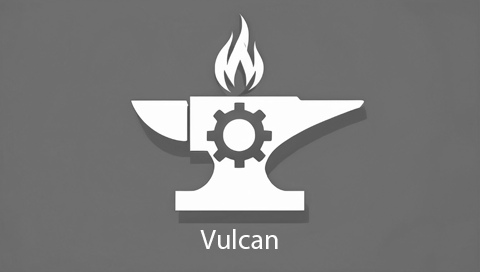

# VEX Robotics Team 36830C - Vulcan

Thank you for coming to the official repository of VEX Robotics Team 36830C, Vulcan! Here we will have all of our code along with  additional information. This will solely be used to document code changes and will thus remain "professional" to provide examples. We will not be accepting pull requests.

## About us

We are Team 36830C - Vulcan, from Auburn High School in Auburn, Alabama.

## Table of Contents
- [VEX Robotics Team 36830C - Vulcan](#vex-robotics-team-36830c---vulcan)
  - [About us](#about-us)
  - [Table of Contents](#table-of-contents)
  - [Team Members](#team-members)
  - [Robot Design](#robot-design)
  - [Programming](#programming)
  - [Highlights](#highlights)
  - [Contact Us](#contact-us)

## Team Members

- Ian (Driver, Designer, Builder, Notebooker)
- Cal (Builder, Designer, Notebooker)
- Hayden (Coder, Designer, Notebooker)

## Robot Design

Our overall design will change throughout the season as the metas shift, but we will remain vigilant throughout as to not completely hole-copy another team's robot. We will be sure to carefully plan, test, and document all changes. One of our foundational beliefs is that a well-designed robot is a key component to winning in the competitive field that is VEX Robotics.

## Programming

Programming is the core component of a robot and team. It's the bread and butter. The oil in an engine. We use various techniques, such as autonomous programs and unique driver controls, to ensure that our robot's competitiveness on the field is fully utilized.

## Highlights

We have not competed yet as we are still building our robot, but we hope to see everyone at Spooky Vex in October!

## Contact Us

Our team would love to connect with the wider robotics community. If you have any questions, comments, concerns, suggestions, or grievances, feel free to reach out to us at [ibrooks6919@gmail.com](mailto:ibrooks6919@gmail.com)
